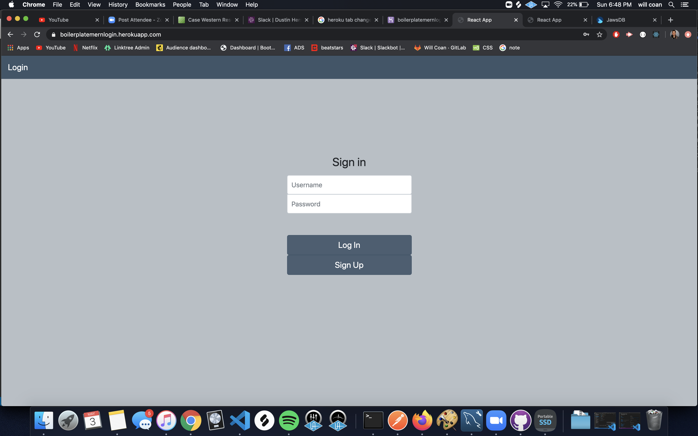
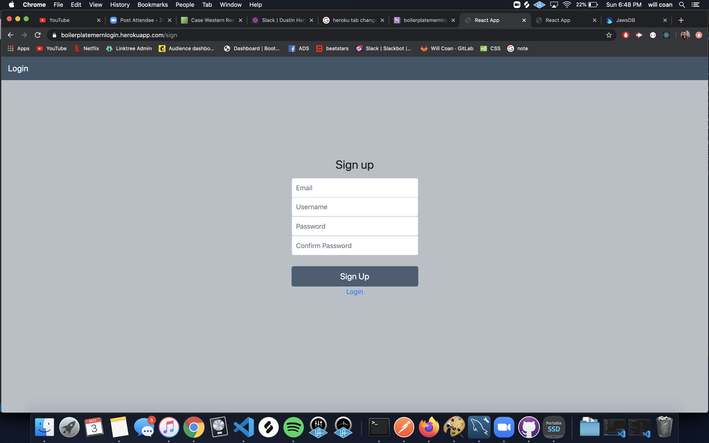
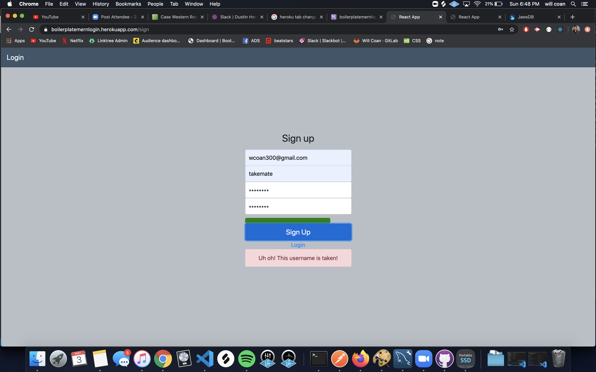
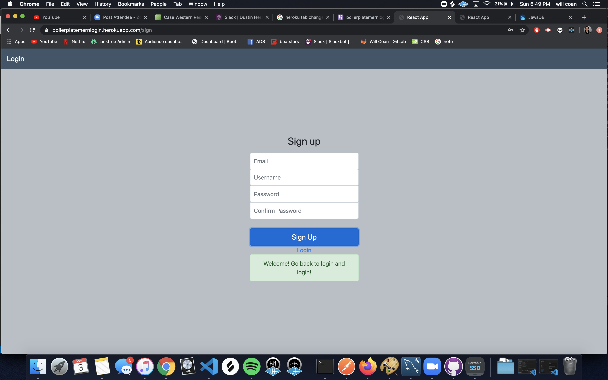

# boilerPlateMernLogin
A simple boilerplate login/sign up for m(ySQL)ern applications.
Featuring Passport, Express Validator and Bcrypt.

Screen where you log in. If password or username is wrong 
an alert displays to tell the user to try again.

Fill out the form to create a user.

Alert displays if:
-Username or Email is already registered
-Password is too short or they don't match

Also displays a password bar to signify password is weak,
moderate or strong

When the user is created successfully an alert pops up to tell user to go back to log in and sign in!

